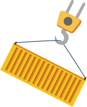
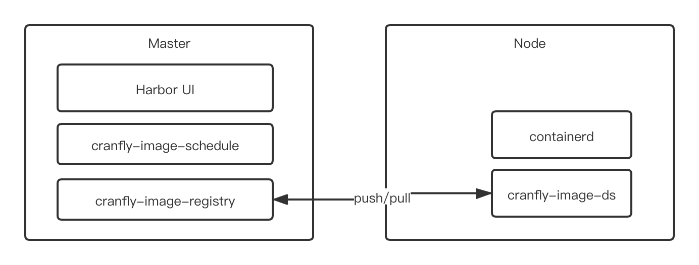

# Cranfly(very early development)
Cloud Native Container Image Distribution Mesh for Kubernetes




**Feature/todo list:**
- [] handle kubelet pull OCI image request, and use P2P feature to cache image.
- [] image distribution mesh UI to manage worklaod pull rules for hosts.

**Architechture:**



**How to Development:**

```rust
cd cranfly
cargo run
```

**References**

- [ImageWolf](https://github.com/ContainerSolutions/ImageWolf)
- [trow](https://github.com/ContainerSolutions/trow)
- [kraken](https://github.com/uber/kraken)


**Notes**

This is the way  - The Mandalorian
