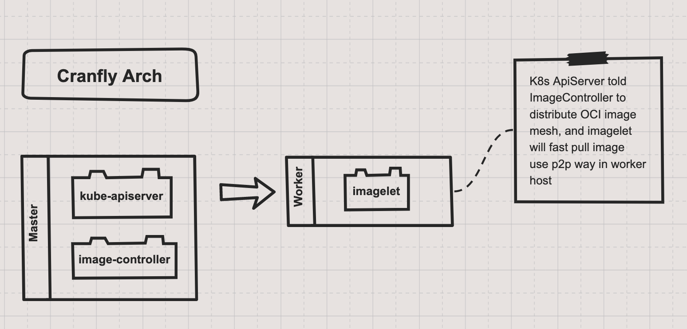

# cranfly(very early development)
Cloud Native Container Image Distribution mesh for kubernetes


**Feature:**
1. seamlessly integrate with trow(rust version image registry), harbor UI(image management)
2. cloud-native architecture for image registry
3. support prefers warm-up image on node host in the app production deliver cycle. (CICD).
4. naive and native deliver image layer tars with embedded p2p tracker.
5. smart schedule for app delivery and deployment with labels.

**Architechture:**



**How to Development:**

```rust
cd cranfly
cargo run
```

**References**

- [ImageWolf](https://github.com/ContainerSolutions/ImageWolf)
- [trow](https://github.com/ContainerSolutions/trow)
- [kraken](https://github.com/uber/kraken)


**Notes**

This is the way  - The Mandalorian
